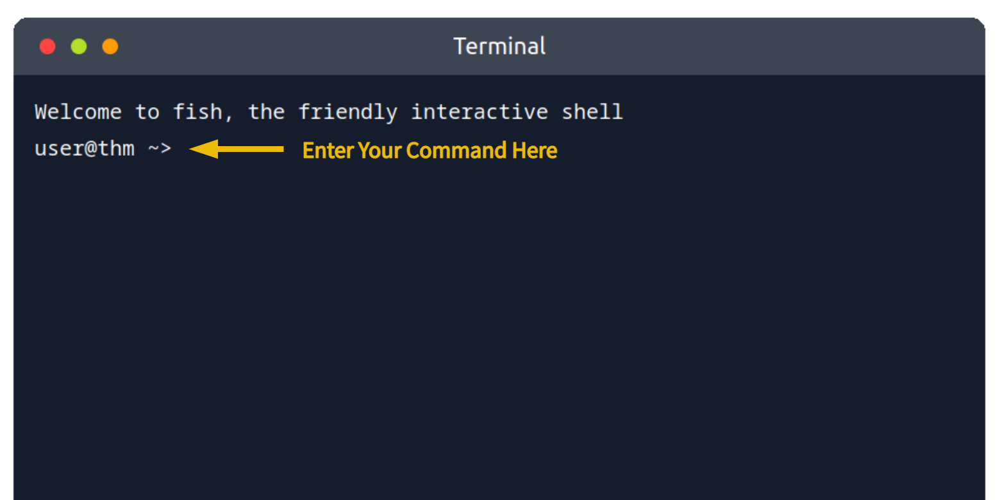
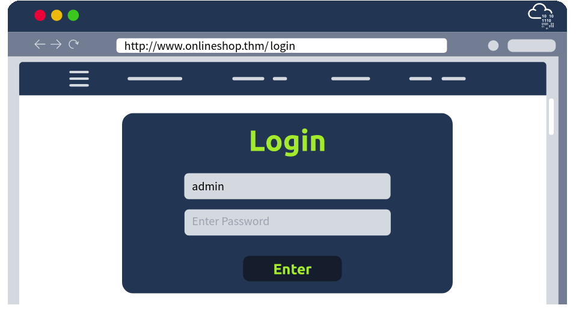

# Become a Hacker - TryHackMe Writeup

**Link:** https://tryhackme.com/room/becomeahacker

**Difficulty:** Easy

**Category:** Web Enumeration / Brute Forcing

---

## 1. Scenario

Mike has spent months building his business and is finally ready to launch his website. Before going live, he wants reassurance that no sensitive or unintended pages have been left publicly accessible. The goal of this assessment was to find any exposed areas of his web application, `http://www.onlineshop.thm/`, that could pose a security risk, before a real attacker does.


---

## 2. Finding Weaknesses - Enumeration

### Manual Enumeration
Before reaching for a tool, I first tried a manual approach, appending common page names directly to the end of the URL to see what existed:

- `sitemap`
- `register`
- `mail`
- `login`
- `admin`

Most of these returned an `Error 404`, meaning the page didn't exist. The one path that worked was `login`.


### Automated Enumeration - Gobuster
To be more thorough than guessing a handful of paths by hand, I used **Gobuster** to automate the process of scanning for hidden directories and files:



```bash
gobuster dir --url http://www.onlineshop.thm/ -w /usr/share/wordlists/dirbuster/directory-list.txt
```

**Command breakdown:**
- `gobuster` — the command-line tool used to perform web content discovery
- `dir` — specifies directory/file enumeration mode, attempting to discover hidden directories and files on the web server
- `--url http://www.onlineshop.thm/` — sets the target website Gobuster will scan
- `-w /usr/share/wordlists/dirbuster/directory-list.txt` — specifies the wordlist Gobuster will use to guess directory and file names

**Takeaway:** a single weakness on its own might not be enough to cause real harm, but a chain of smaller weaknesses together can add up to a serious threat.

---

## 3. Exploiting Weaknesses - Gaining Access

### Manual Credential Guessing
With the `login` page confirmed, the next step was trying to find valid credentials. I started with one of the most commonly used usernames, `admin`, and tried a short list of common passwords manually:

- `abc123`
- `123456`
- `password`
- `qwerty`
- `654321`

Testing them one by one, `qwerty` turned out to be the correct password, which gave access and revealed the room's flag.



### Automated Exploitation - Hydra
To also practice automating this process, I repeated the same attack using **Hydra**, a tool for performing dictionary attacks (systematically trying a list of possible passwords against a login form):


```bash
hydra -l admin -P passlist.txt www.onlineshop.thm http-post-form "/login:username=^USER^&password=^PASS^:F=incorrect" -V
```

**Command breakdown:**
- `hydra` — the command-line tool used to perform the dictionary attack
- `-l admin` — attempts to log in using the username `admin`
- `-P passlist.txt` — specifies the password list to try
- `www.onlineshop.thm` — sets the target website
- `http-post-form` — indicates that this is an HTTP POST request form
- `"/login:username=^USER^&password=^PASS^:F=incorrect"` — specifies how the login request is sent and how Hydra determines whether a login attempt has failed
- `-V` — enables verbose output, showing every username/password combination attempted

Hydra confirmed the same result: `qwerty` was the correct password.

---

## 4. Lessons Learned

- Manual testing is a good starting point, but automated tools like Gobuster cover far more ground in far less time.
- A single weak point (like one guessable path) isn't always dangerous on its own — it's the combination of weaknesses (an exposed login page + a weak password) that creates real risk.
- Common, weak passwords remain one of the easiest ways into a system, whether guessed manually or cracked automatically with a dictionary attack.
- Doing the same attack both manually and with a tool (Hydra) helped confirm the finding and reinforced how the tool automates a process that's otherwise slow and error-prone by hand.
