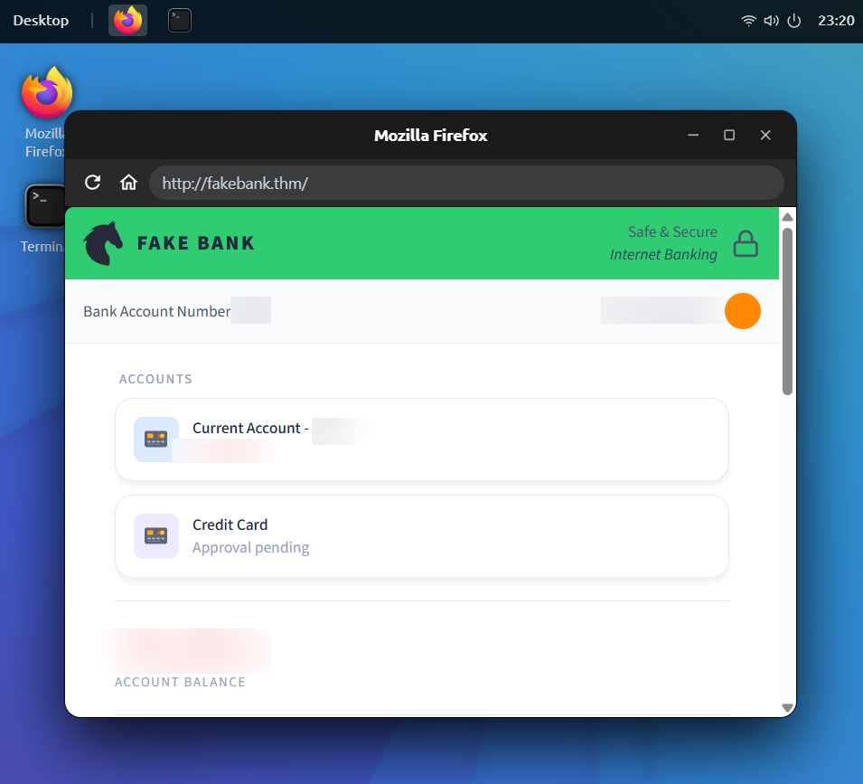
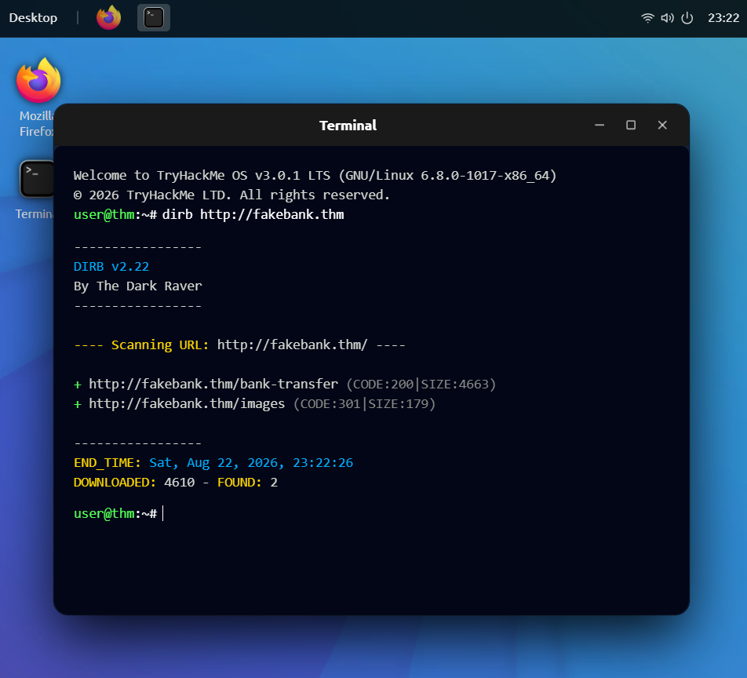
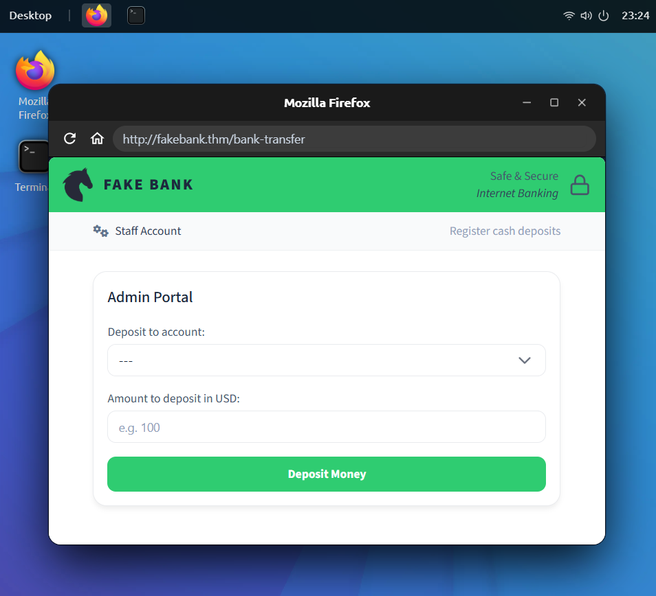

# Offensive Security Intro - TryHackMe Writeup

**Link:** https://tryhackme.com/room/offensivesecurityintro

**Difficulty:** Easy

**Category:** Intro to Offensive Security

---

## 1. Overview

A beginner-friendly introduction to offensive security concepts, built around a practical scenario: hacking into a fake bank website (FakeBank) using basic directory enumeration.



---

## 2. Enumeration

Since the target website was already known, the first step was directory brute-forcing using **dirbuster** to discover hidden pages not linked anywhere on the site.

```bash
dirb http://fakebank.thm
```

**Result:** The scan revealed hidden pages accessible on the site, including a `bank-transfer` page that allowed bank transfer operations.



---

## 3. Exploitation

After navigating to the discovered path, I was able to interact with the transfer page directly without any login required. This highlights how the absence of proper access control on administrative pages allows anyone who knows the URL to reach them.



---

## 4. Lessons Learned

- Offensive Security means simulating real attacks to find weaknesses before an actual attacker does.
- Tools like **dirbuster** can find pages on a website that aren't linked anywhere, just by guessing common names from a wordlist.
- Not every page on a website is meant to be public. some are just unlisted, not actually protected.
