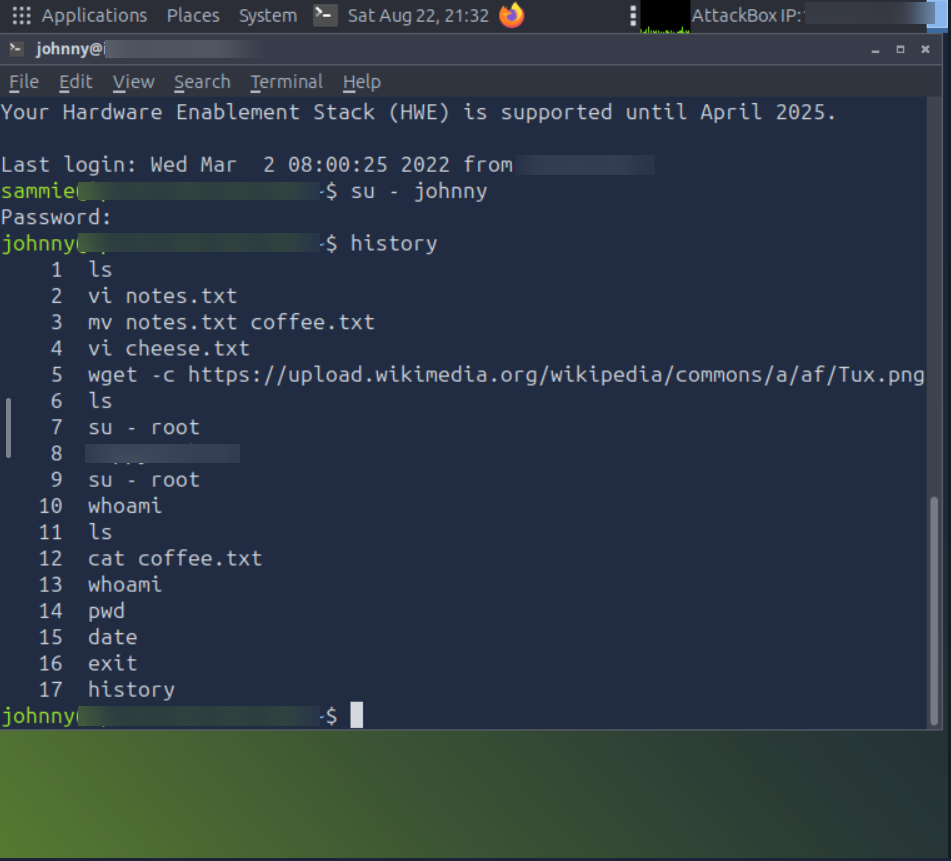

# Operating System Security - TryHackMe Writeup

**Link:** https://tryhackme.com/room/operatingsystemsecurity

**Difficulty:** Easy

**Category:** Operating Systems / SSH Authentication / Privilege Escalation

---

## 1. Overview

The scenario: I’m acting as a security consultant checking a client’s environment. Using an attacker machine, the goal was to gain remote access to a Linux machine over SSH with a known username but no password, then escalate privileges to root.

---

## 2. Initial Access

### Gathering the Password
While reviewing the client’s office, I noticed a sticky note on one of the monitors with two words on it: a username-looking word and what looked like a password. This is a classic example of weak physical security, sensitive credentials should never be written down and left visible.

### Connecting via SSH
```bash
ssh sammie@MACHINE_IP
```
On the first connection to a new server, SSH shows a warning about the server’s authenticity and asks to confirm the connection. I accepted with yes, which is expected and normal the first time you connect to any new host.

Using the password from the sticky note, the login succeeded.

```bash
whoami
```
Confirmed I was logged in as sammie.

```
user@AttackBox# ssh sammie@MACHINE_IP
The authenticity of host 'MACHINE_IP (MACHINE_IP)' can't be established.
ECDSA key fingerprint is [REDACTED].
Are you sure you want to continue connecting (yes/no)? yes
Warning: Permanently added 'MACHINE_IP' (ECDSA) to the list of known hosts.
sammie@MACHINE_IP's password: 
Welcome to Ubuntu 20.04.4 LTS (GNU/Linux 5.4.0-100-generic x86_64)

 * Documentation:  https://help.ubuntu.com
 * Management:     https://landscape.canonical.com
 * Support:        https://ubuntu.com/advantage

  System information as of Tue  1 Mar 13:20:32 UTC 2022

  System load:  0.03              Processes:              216
  Usage of /:   51.8% of 6.53GB   Users logged in:        1
  Memory usage: 17%               IPv4 address for ens33: MACHINE_IP
  Swap usage:   0%

 * Super-optimized for small spaces - read how we shrank the memory
   footprint of MicroK8s to make it the smallest full K8s around.

   https://ubuntu.com/blog/microk8s-memory-optimisation

0 updates can be applied immediately.


Last login: Tue Mar  1 09:46:11 2022 from MACHINE_IP
sammie@MACHINE_IP:~$ whoami
sammie
sammie@MACHINE_IP:~$ ls
country.txt  draft.md  icon.png  password.txt  profile.jpg
sammie@MACHINE_IP:~$ cat draft.md 
```

---

## 3. Local Enumeration
```bash
ls
cat FILENAME
```
Used these to look around the home directory and check the contents of a readable file, to get a feel for what was on the system and whether anything useful (credentials, notes, configs) was left behind.

---

## 4. Lateral Movement to Another User

I noticed a second user account (johnny) on the system. Rather than another sticky note, this password had to be guessed. I used a list of the most common/weak passwords (frequently used in wordlists precisely because real users pick them) and tried them one by one against johnny's account. One of the entries from that common-password list worked, and I was able to switch to johnny's session.

This step reinforced a simple but important point: weak, predictable passwords are just as exploitable as passwords left on a sticky note, automated tools can burn through common password lists very quickly.

---

## 5. Privilege Escalation to Root
```bash
history
```
Checking johnny’s command history turned out to be the key step. It showed that at some point, johnny had accidentally typed the root password into the terminal instead of a command. a common real-world mistake where a password gets pasted or typed in the wrong window, and ends up sitting in plaintext in the shell history.

Using that exposed password:

```bash
su - root
```
This granted full root access.

Once in the root home directory, I found a file:

```bash
cat flag.txt
```
This contained the room’s flag, confirming full compromise of the system from an unauthenticated starting point.



---

## 6. Lessons Learned

- Physical security matters as much as digital security: a password on a sticky note bypasses every other control on the system.
- Weak/common passwords are guessable: a short list of the most-used passwords was enough to compromise a second account.
- Command history can leak credentials: typing a password by mistake into a terminal (instead of a password prompt) can leave it sitting in plaintext, retrievable by anyone with access to that shell.
- Privilege escalation doesn’t always require an exploit: often it’s just a chain of small, human mistakes rather than a single technical flaw.
